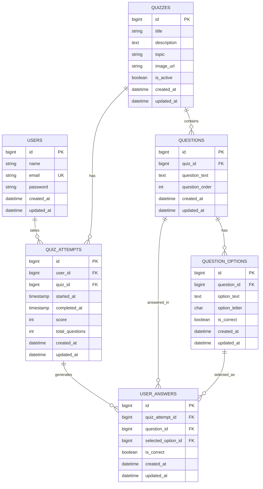
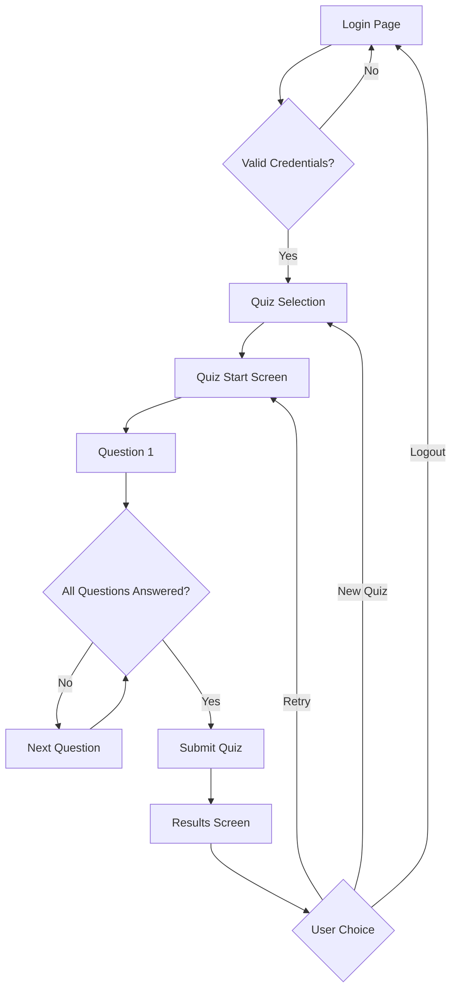

# BrainPOP Quiz - Architecture Documentation

## 🏗️ **System Overview**

A full-stack quiz application built with Vue 3 frontend, Laravel 10 backend, and SQLite database. The system implements a complete quiz-taking flow with authentication, state persistence, and comprehensive result tracking.

## 📋 **Architecture Principles**

- **Separation of Concerns**: Clear boundaries between presentation, business logic, and data layers
- **API-First Design**: RESTful backend serves as single source of truth
- **State Management**: Centralized state with persistence across sessions
- **Component-Based UI**: Reusable Vue components with single responsibility
- **Progressive Enhancement**: Graceful degradation and error handling

---

## 🎯 **Frontend Architecture**

### **Technology Stack**
- **Vue 3** (Composition API + Options API)
- **Pinia** for state management
- **Vue Router** for SPA navigation
- **SCSS** for styling
- **Vite** for build tooling

### **Project Structure**
```
client/
├── src/
│   ├── components/
│   │   ├── base/           # Reusable UI components
│   │   ├── compositions/   # Business logic components
│   │   ├── layout/         # Layout components
│   │   └── screens/        # Page-level components
│   ├── config/             # Configuration files
│   ├── services/           # API and external services
│   ├── stores/             # Pinia state stores
│   ├── utilities/          # Helper functions and styles
│   └── assets/             # Static assets
```

### **Key Architectural Decisions**

#### **Centralized API Service**
```javascript
// Single source of truth for all API communication
class ApiService {
  async makeRequest(endpoint, method, data, requiresAuth) {
    // Unified error handling, auth management, base URL configuration
  }
}
```

**Benefits:**
- Eliminates code duplication
- Centralized authentication handling
- Environment-based configuration
- Consistent error handling

#### **State Management Strategy**
```javascript
// Pinia stores for global state
const useUserStore = defineStore('user', {
  state: () => ({ loggedIn: false, user: null }),
  getters: { isLoggedIn: (state) => /* logic */ },
  actions: { login, logout }
})
```

**Features:**
- Persistent login state across sessions
- Quiz progress preservation on page refresh
- Reactive state updates across components

#### **Component Architecture**
- **Atomic Design**: Base components → Compositions → Screens
- **Event-Driven Communication**: Parent-child communication via props/events
- **Single Responsibility**: Each component has one clear purpose

---

## 🔧 **Backend Architecture**

### **Technology Stack**
- **Laravel 10** (PHP 8.1+)
- **Laravel Sanctum** for API authentication
- **SQLite** for development/testing
- **Eloquent ORM** for database operations

### **Project Structure**
```
server/
├── app/
│   ├── Http/
│   │   ├── Controllers/    # API endpoints
│   │   ├── Middleware/     # Request processing
│   │   └── Requests/       # Input validation
│   └── Models/             # Eloquent models
├── database/
│   ├── migrations/         # Database schema
│   └── seeders/            # Test data
└── routes/
    └── api.php            # API route definitions
```

### **Database Design**

#### **Entity Relationship Model**


#### **Key Design Decisions**

**Normalized Schema:**
- Prevents data duplication
- Enables flexible quiz structures
- Supports detailed analytics

**Audit Trail:**
- Complete answer history per attempt
- Timestamped quiz sessions
- Score calculation integrity

### **API Design**

#### **RESTful Endpoints**
```
POST   /api/login                          # Authentication
GET    /api/quizzes                        # List available quizzes
GET    /api/quiz/{id}                      # Get quiz details
POST   /api/quiz/{id}/start                # Start quiz attempt
POST   /api/quiz-attempt/{id}/answer       # Submit answer
POST   /api/quiz-attempt/{id}/complete     # Finalize attempt
GET    /api/quiz-attempt/{id}/results      # Get results
GET    /api/quiz-attempt/{id}/status       # Check progress
```

#### **Authentication Strategy**
- **Laravel Sanctum** for SPA authentication
- **Bearer token** approach
- **Automatic token expiry** handling
- **Stateless API** design

---

## 🔄 **Application Flow**

### **User Journey**


### **State Persistence Strategy**
```javascript
// Quiz state survives page refreshes
const savedState = {
  quizState: 'questions',
  quizId: 1,
  attemptId: 42,
  currentQuestionIndex: 3
}
localStorage.setItem('brainpop_quiz_state', JSON.stringify(savedState))
```

---

## 🧪 **Testing Strategy**

### **E2E Testing with Playwright**
```
tests/e2e/
├── specs/
│   ├── quiz-flow.spec.js      # Complete user journey
│   ├── auth-and-errors.spec.js # Authentication & error handling
│   ├── api-integration.spec.js # Backend integration
│   └── responsive.spec.js     # Mobile/tablet layouts
├── utils/
│   └── test-helpers.js        # Reusable test utilities
└── config/
    └── playwright.config.js   # Test configuration
```

**Test Coverage:**
- ✅ Complete quiz flow (login → quiz → results)
- ✅ Navigation and state persistence
- ✅ API error handling
- ✅ Authentication scenarios
- ✅ Responsive design
- ✅ Cross-browser compatibility

---

## 🚀 **Deployment Architecture**

### **Environment Configuration**
```javascript
// Environment-based API URLs
const API_CONFIG = {
  BASE_URL: import.meta.env.VITE_API_BASE_URL || 'http://localhost:3000'
}
```

### **Scalability Considerations**

**Frontend:**
- **CDN-ready**: Static assets optimized for distribution
- **Code splitting**: Lazy-loaded routes and components
- **PWA-ready**: Service worker and offline capabilities

**Backend:**
- **Stateless design**: Horizontal scaling ready
- **Database optimization**: Indexed queries, eager loading
- **Caching strategy**: Redis/Memcached integration ready

---

## 🔒 **Security Measures**

### **Authentication & Authorization**
- **CSRF protection** via Laravel Sanctum
- **Password hashing** with bcrypt
- **Token-based authentication** for API access
- **Route protection** on both frontend and backend

### **Data Validation**
- **Input sanitization** via Laravel Form Requests
- **Frontend validation** for UX
- **API rate limiting** to prevent abuse

### **Security Headers**
- **CORS configuration** for cross-origin requests
- **Content Security Policy** headers
- **XSS protection** via Laravel's built-in helpers

---

## 📊 **Performance Optimizations**

### **Frontend**
- **Lazy loading** of quiz content
- **Optimistic UI updates** for answer submission
- **Local state caching** to reduce API calls
- **Image optimization** and asset compression

### **Backend**
- **Eager loading** to prevent N+1 queries
- **Database indexing** on foreign keys and search fields
- **Response caching** for static quiz data
- **Optimized JSON responses** with only required fields

---

## 🛠️ **Development Workflow**

### **Local Development**
```bash
# Backend setup
cd server && composer install && php artisan serve

# Frontend setup  
cd client && npm install && npm run dev

# E2E testing
npm run test:e2e
```

### **Code Quality**
- **ESLint** for JavaScript code standards
- **PHP-CS-Fixer** for PHP code formatting
- **Laravel Pint** for consistent code style
- **Playwright** for comprehensive E2E testing

---

## 🔮 **Future Enhancements**

### **Technical Improvements**
- **TypeScript migration** for better type safety
- **GraphQL API** for more efficient data fetching
- **Real-time features** with WebSockets (live quiz sessions)
- **Progressive Web App** capabilities

### **Feature Enhancements**
- **Quiz analytics dashboard** for educators
- **Timed quizzes** with countdown functionality
- **Question randomization** and answer shuffling
- **Multi-language support** with i18n
- **Accessibility improvements** (WCAG compliance)

---

## 📋 **Technical Specifications**

### **Browser Support**
- Chrome/Edge 90+
- Firefox 88+
- Safari 14+
- Mobile browsers (iOS Safari, Chrome Mobile)

### **Performance Targets**
- **First Contentful Paint**: < 1.5s
- **Largest Contentful Paint**: < 2.5s
- **Time to Interactive**: < 3.5s
- **API Response Time**: < 200ms (95th percentile)

### **Accessibility**
- **WCAG 2.1 AA** compliance
- **Keyboard navigation** support
- **Screen reader** compatibility
- **High contrast** mode support

---

*This architecture supports a scalable, maintainable, and user-friendly quiz application that can grow with future requirements while maintaining code quality and performance standards.*